# Modélisation UML : Diagramme de Classes

Ce document détaille l'architecture logicielle et le modèle objet complet du jeu *Seasons*, conçu selon les principes **SOLID** et les bonnes pratiques de génie logiciel enseignées dans l'UE (séparation stricte entre le Modèle du domaine, le Moteur d'arbitrage et les Stratégies de robots).

---

## 1. Vue d'Ensemble des Packages

L'architecture est structurée en 3 packages découplés :
1. `model` : Entités pures du domaine (Plateau, Saisons, Dés, Énergies, Réserve, Cartes, Joueurs).
2. `engine` : Moteur de déroulement, boucle de jeu, validation des règles et calcul des scores.
3. `bot` : Interface et stratégies décisionnelles des robots autonomes.

---

## 2. Diagramme de Classes Complet (Mermaid)

```mermaid
classDiagram
    direction TB

    %% ==========================================
    %% PACKAGE MODEL : ÉLÉMENTS DE BASE DU DOMAINE
    %% ==========================================

    class Energie {
        <<enumeration>>
        EAU
        TERRE
        FEU
        AIR
    }

    class Saison {
        <<enumeration>>
        HIVER
        PRINTEMPS
        ETE
        AUTOMNE
        +getEnergieAbondante() List~Energie~
        +getEnergieRare() List~Energie~
        +getEnergieIntrouvable() Energie
    }

    class TableCristallisation {
        +getTaux(saison: Saison, energie: Energie) int
    }

    class FaceDe {
        -cristauxGagnes: int
        -energiesGagnees: List~Energie~
        -augmentationJauge: int
        -piocheCarte: boolean
        -autorisationCristalliser: boolean
        -pointsAvancementTemps: int
        +getCristauxGagnes() int
        +getEnergiesGagnees() List~Energie~
        +getAugmentationJauge() int
        +isPiocheCarte() boolean
        +isAutorisationCristalliser() boolean
        +getPointsAvancementTemps() int
    }

    class De {
        -id: int
        -saison: Saison
        -faces: List~FaceDe~
        -faceCourante: FaceDe
        +lancer() FaceDe
        +getFaceCourante() FaceDe
        +getSaison() Saison
    }

    class ReserveEnergie {
        -CAPACITE_MAX: int = 7
        -stock: List~Energie~
        +ajouter(energie: Energie) boolean
        +retirer(energie: Energie) boolean
        +retirerPlusieurs(aRetirer: List~Energie~) boolean
        +estPleine() boolean
        +getTaille() int
        +getEnergies() List~Energie~
        +viderSurplus(aGarder: List~Energie~) void
    }

    class PisteBonus {
        -CAPACITE_MAX_BONUS: int = 3
        -bonusUtilises: int
        +utiliserBonus(typeBonus: TypeBonus) boolean
        +getMalusPoints() int
        +getNombreBonusUtilises() int
    }

    class TypeBonus {
        <<enumeration>>
        ECHANGE_DEUX_ENERGIES
        CRISTALLISATION_BONUS_PLUS_UN
        AUGMENTATION_JAUGE_PLUS_UN
        PIOCHE_DEUX_GARDER_UNE
    }

    class TypeCarte {
        <<enumeration>>
        OBJET_MAGIQUE
        FAMILIER
    }

    class TypeEffet {
        <<enumeration>>
        ARRIVEE_EN_JEU
        PERMANENT
        ACTIVATION_MANCHE
    }

    class CartePouvoir {
        <<abstract>>
        #id: int
        #nom: String
        #coutEnergies: List~Energie~
        #coutCristaux: int
        #pointsPrestige: int
        #typeCarte: TypeCarte
        #typeEffet: TypeEffet
        #estInclinee: boolean
        +appliquerEffetArrivee(contexte: ContexteJeu) void
        +activer(contexte: ContexteJeu) void
        +redresser() void
        +getCoutEnergies() List~Energie~
        +getCoutCristaux() int
        +getPointsPrestige() int
        +getTypeCarte() TypeCarte
        +getTypeEffet() TypeEffet
        +isEstInclinee() boolean
    }

    class ObjetMagique {
        +appliquerEffetArrivee(contexte: ContexteJeu) void
        +activer(contexte: ContexteJeu) void
    }

    class Familier {
        +appliquerEffetArrivee(contexte: ContexteJeu) void
        +activer(contexte: ContexteJeu) void
    }

    class Joueur {
        -id: int
        -nom: String
        -cristaux: int
        -jaugeInvocation: int
        -reserve: ReserveEnergie
        -pisteBonus: PisteBonus
        -mainCartes: List~CartePouvoir~
        -cartesEnJeu: List~CartePouvoir~
        -bibliothequeAn2: List~CartePouvoir~
        -bibliothequeAn3: List~CartePouvoir~
        +ajouterCristaux(montant: int) void
        +retirerCristaux(montant: int) boolean
        +augmenterJauge(increment: int) void
        +peutInvoquer() boolean
        +invoquerCarte(carte: CartePouvoir) boolean
        +debloquerCartesAnnee(annee: int) void
        +getCristaux() int
        +getJaugeInvocation() int
        +getReserve() ReserveEnergie
        +getPisteBonus() PisteBonus
        +getCartesEnJeu() List~CartePouvoir~
        +getMainCartes() List~CartePouvoir~
    }

    class Plateau {
        -annee: int
        -moisCourant: int
        -saisonCourante: Saison
        -desSaison: List~De~
        -deResiduel: De
        +avancerTemps(nbMois: int) boolean
        +getSaisonCourante() Saison
        +getAnnee() int
        +getMoisCourant() int
        +estPartieTerminee() boolean
        +preparerDesManche(nbJoueurs: int) List~De~
    }

    %% ==========================================
    %% PACKAGE BOT : STRATÉGIES DECISIONNELLES
    %% ==========================================

    class DecisionBot {
        <<interface>>
        +choisirDe(desDisponibles: List~De~, joueur: Joueur, plateau: Plateau) De
        +choisirEnergiesACristalliser(joueur: Joueur, plateau: Plateau) List~Energie~
        +choisirCarteAInvoquer(joueur: Joueur, plateau: Plateau) CartePouvoir
        +choisirCartesAActiver(joueur: Joueur, plateau: Plateau) List~CartePouvoir~
        +choisirEnergiesAGarder(reserve: List~Energie~, max: int) List~Energie~
        +choisirBonusAUtiliser(joueur: Joueur) TypeBonus
    }

    class RobotAleatoire {
        +choisirDe(desDisponibles: List~De~, joueur: Joueur, plateau: Plateau) De
        +choisirEnergiesACristalliser(joueur: Joueur, plateau: Plateau) List~Energie~
        +choisirCarteAInvoquer(joueur: Joueur, plateau: Plateau) CartePouvoir
        +choisirCartesAActiver(joueur: Joueur, plateau: Plateau) List~CartePouvoir~
        +choisirEnergiesAGarder(reserve: List~Energie~, max: int) List~Energie~
        +choisirBonusAUtiliser(joueur: Joueur) TypeBonus
    }

    class RobotIntelligentCristallisation {
        +choisirDe(desDisponibles: List~De~, joueur: Joueur, plateau: Plateau) De
        +choisirEnergiesACristalliser(joueur: Joueur, plateau: Plateau) List~Energie~
        +choisirCarteAInvoquer(joueur: Joueur, plateau: Plateau) CartePouvoir
        +choisirCartesAActiver(joueur: Joueur, plateau: Plateau) List~CartePouvoir~
        +choisirEnergiesAGarder(reserve: List~Energie~, max: int) List~Energie~
        +choisirBonusAUtiliser(joueur: Joueur) TypeBonus
    }

    class RobotIntelligentPrestige {
        +choisirDe(desDisponibles: List~De~, joueur: Joueur, plateau: Plateau) De
        +choisirEnergiesACristalliser(joueur: Joueur, plateau: Plateau) List~Energie~
        +choisirCarteAInvoquer(joueur: Joueur, plateau: Plateau) CartePouvoir
        +choisirCartesAActiver(joueur: Joueur, plateau: Plateau) List~CartePouvoir~
        +choisirEnergiesAGarder(reserve: List~Energie~, max: int) List~Energie~
        +choisirBonusAUtiliser(joueur: Joueur) TypeBonus
    }

    %% ==========================================
    %% PACKAGE ENGINE : ARBITRAGE ET MOTEUR
    %% ==========================================

    class ScoreBilan {
        -joueur: Joueur
        -cristauxFinaux: int
        -prestigeCartes: int
        -malusCartesMain: int
        -malusBonus: int
        -scoreTotal: int
        +getScoreTotal() int
    }

    class CalculateurScore {
        +calculerScore(joueur: Joueur) ScoreBilan
        +determinerClassement(joueurs: List~Joueur~) List~ScoreBilan~
        +departagerEgalite(a: Joueur, b: Joueur) int
    }

    class MoteurJeu {
        -plateau: Plateau
        -joueurs: List~Joueur~
        -strategies: Map~Joueur, DecisionBot~
        -tableCristallisation: TableCristallisation
        -calculateurScore: CalculateurScore
        -premierJoueurIndex: int
        +initialiserPartie() void
        +executerManche() void
        +executerPartieComplete() List~ScoreBilan~
        +pivoterPremierJoueur() void
    }

    %% ==========================================
    %% RELATIONS ET CARDINALITÉS
    %% ==========================================

    Plateau "1" *-- "1..*" De : gere
    De "1" *-- "6" FaceDe : possede
    FaceDe "1" o-- "*" Energie : rapporte
    De --> Saison : appartientA

    Joueur "1" *-- "1" ReserveEnergie : possede
    Joueur "1" *-- "1" PisteBonus : possede
    Joueur "1" o-- "*" CartePouvoir : detient
    ReserveEnergie "1" o-- "0..7" Energie : stocke
    PisteBonus --> TypeBonus : utilise

    CartePouvoir <|-- ObjetMagique
    CartePouvoir <|-- Familier
    CartePouvoir --> TypeCarte : qualifie
    CartePouvoir --> TypeEffet : declenche
    CartePouvoir "1" o-- "*" Energie : coute

    DecisionBot <|.. RobotAleatoire
    DecisionBot <|.. RobotIntelligentCristallisation
    DecisionBot <|.. RobotIntelligentPrestige

    MoteurJeu "1" *-- "1" Plateau : controle
    MoteurJeu "1" o-- "3" Joueur : arbitre
    MoteurJeu "1" --> "1" TableCristallisation : applique
    MoteurJeu "1" --> "1" CalculateurScore : sollicite
    MoteurJeu "1" --> "*" DecisionBot : interroge
    CalculateurScore ..> ScoreBilan : produit
```

---

## 3. Justification des Choix de Conception

1. **Faible couplage (SoC)** : 
   - `Joueur` est une entité passive contenant son état (cristaux, cartes, réserve). Aucune intelligence artificielle n'y est codée directement.
   - Les décisions sont déléguées à l'interface `DecisionBot` (Pattern Stratégie), permettant d'injecter indifféremment un `RobotAleatoire`, `RobotIntelligentCristallisation` ou `RobotIntelligentPrestige`.
2. **Capacité stricte de la réserve (7 énergies)** :
   - `ReserveEnergie` encapsule l'invariant officiel : un joueur ne peut jamais conserver plus de 7 énergies à la fin de son action. La méthode `viderSurplus()` oblige le robot à faire un choix immédiat s'il dépasse cette limite.
3. **Immutabilité des règles temporelles** :
   - `TableCristallisation` et `Saison` définissent de manière inaltérable le cours des énergies et les disponibilités des 4 saisons de l'année.
4. **Calcul et départage des scores** :
   - `CalculateurScore` isole l'algorithme officiel : `Score = Cristaux + Prestige des cartes posées - (5 * Cartes restantes en main) - Malus bonus`. En cas d'égalité, le départage s'effectue au plus grand nombre de cartes posées, puis au plus grand nombre de cristaux.
