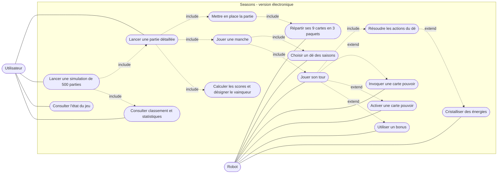

# 01 — Diagramme de cas d'utilisation

**Sprint 1 — dossier de conception — Seasons (version débutante, 30 cartes)**

## 1. Acteurs

| Acteur | Rôle |
|---|---|
| **Utilisateur** (étudiant, enseignant, client) | Lance les exécutions Maven et lit les sorties textuelles |
| **Robot** | Joueur automatique : prend toutes les décisions d'un joueur (choix du dé, cartes, actions) |
| **Moteur de jeu** | Système : applique les règles, arbitre les actions des robots |

## 2. Diagramme

> Mermaid ne propose pas de diagramme de cas d'utilisation natif : il est représenté avec un `flowchart` (acteurs en haut, cas d'utilisation en ovale, relations `include` en pointillé).

## 3. Description des cas d'utilisation principaux

### UC1 — Lancer une partie détaillée

| | |
|---|---|
| **Acteur** | Utilisateur |
| **Déclencheur** | `mvn exec:java@partie` |
| **Pré-condition** | 2 à 4 robots configurés |
| **Scénario nominal** | 1. Le moteur met en place la partie (UC5). 2. Il enchaîne les manches (UC6) jusqu'à la fin de la 3e année. 3. Il calcule les scores (UC8). 4. L'afficheur textuel décrit chaque étape et le résultat final. |
| **Post-condition** | Le vainqueur et le détail des points sont affichés |
| **Variantes** | Nombre de joueurs 2, 3 ou 4 ; composition des robots ; graine aléatoire fixée pour rejouer la même partie |

### UC2 — Lancer une simulation de 500 parties

| | |
|---|---|
| **Acteur** | Utilisateur |
| **Déclencheur** | `mvn exec:java@simulation` |
| **Scénario nominal** | 1. Le simulateur enchaîne 500 parties avec un afficheur silencieux. 2. Il cumule victoires, points, égalités. 3. Il affiche uniquement le résumé global (UC4). |
| **Post-condition** | Classement des robots, moyenne des points et autres statistiques affichés |
| **Règle** | Aucune autre sortie textuelle que le résumé |

### UC7 — Jouer son tour

| | |
|---|---|
| **Acteur** | Robot (via le moteur) |
| **Pré-condition** | Le joueur a choisi son dé des saisons |
| **Scénario nominal** | 1. Le moteur résout les actions du dé (pioche, énergies, cristaux, jauge). 2. Tant que le robot ne termine pas son tour, le moteur lui propose la liste des actions légales (invoquer, activer, bonus, cristalliser). 3. Le robot en choisit une, le moteur l'applique et publie les événements. 4. Le robot termine son tour. |
| **Règles clés** | Les actions du dé qui donnent pioche, énergies, cristaux et jauge sont résolues avant toute autre action ; la cristallisation est valable jusqu'à la fin du tour ; on peut invoquer plusieurs cartes par tour si le coût et la jauge le permettent |
