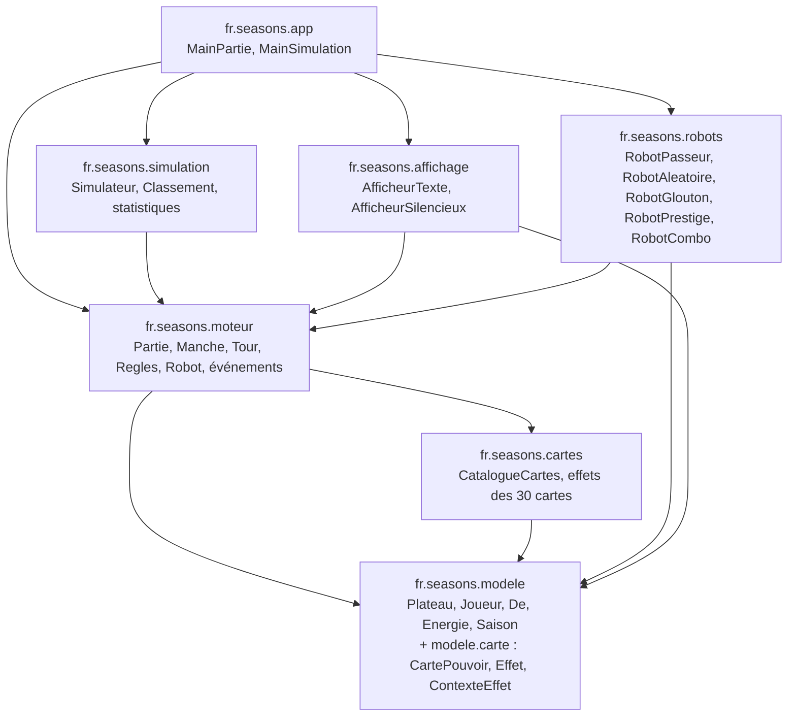
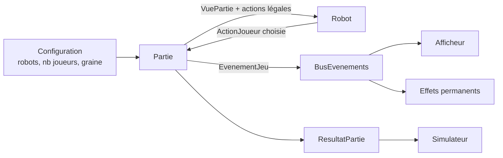

# 02 — Architecture et diagramme de packages

## 1. Principes

- **Le moteur ne connaît pas les robots concrets.** Il connaît seulement l'interface `Robot` (définie dans `moteur`). Les robots dépendent du moteur, jamais l'inverse.
- **Les effets de cartes ne connaissent pas le moteur.** Ils utilisent l'interface `ContexteEffet` (définie dans `modele.carte`) que le moteur implémente.
- **L'affichage est un observateur.** Il écoute les événements publiés par le moteur ; il peut être remplacé (textuel, silencieux) sans toucher au moteur.
- **Les données des cartes sont dans des fichiers** (`cartes.json`) ; le code ne contient que la logique des effets.

## 2. Diagramme de packages



## 3. Responsabilités

| Package | Responsabilité | Dépend de |
|---|---|---|
| `fr.seasons.modele` | État du jeu : énergies, saisons, dés, plateau, joueurs, pions, cartes (données) et abstractions d'effets | rien |
| `fr.seasons.cartes` | Catalogue des 30 cartes, chargement du JSON, implémentation concrète de chaque effet, jeux pré-construits | `modele` |
| `fr.seasons.moteur` | Règles, déroulement (mise en place, manches, tours), actions, événements, décompte, interface `Robot` | `modele`, `cartes` |
| `fr.seasons.robots` | Stratégies de jeu (implémentations de `Robot`) | `moteur`, `modele` |
| `fr.seasons.affichage` | Rendu textuel de l'état et du déroulé | `moteur`, `modele` |
| `fr.seasons.simulation` | Exécution de N parties, agrégation des résultats | `moteur` |
| `fr.seasons.app` | Points d'entrée des deux exécutions Maven, assemblage | tous |

## 4. Arborescence du projet Maven

```text
seasons/
├── pom.xml
├── README.md
├── docs/                      <- ce dossier de conception
└── src/
    ├── main/
    │   ├── java/fr/seasons/
    │   │   ├── modele/ (+ modele/carte/)
    │   │   ├── cartes/ (+ cartes/effets/)
    │   │   ├── moteur/
    │   │   ├── robots/
    │   │   ├── affichage/
    │   │   ├── simulation/
    │   │   └── app/
    │   └── resources/
    │       ├── cartes.json            <- 30 cartes (données)
    │       ├── jeux-preconstruits.json <- 4 jeux de 9 cartes
    │       └── des.json               <- faces des 20 dés
    └── test/java/fr/seasons/...
```

## 5. Flux de données principal


