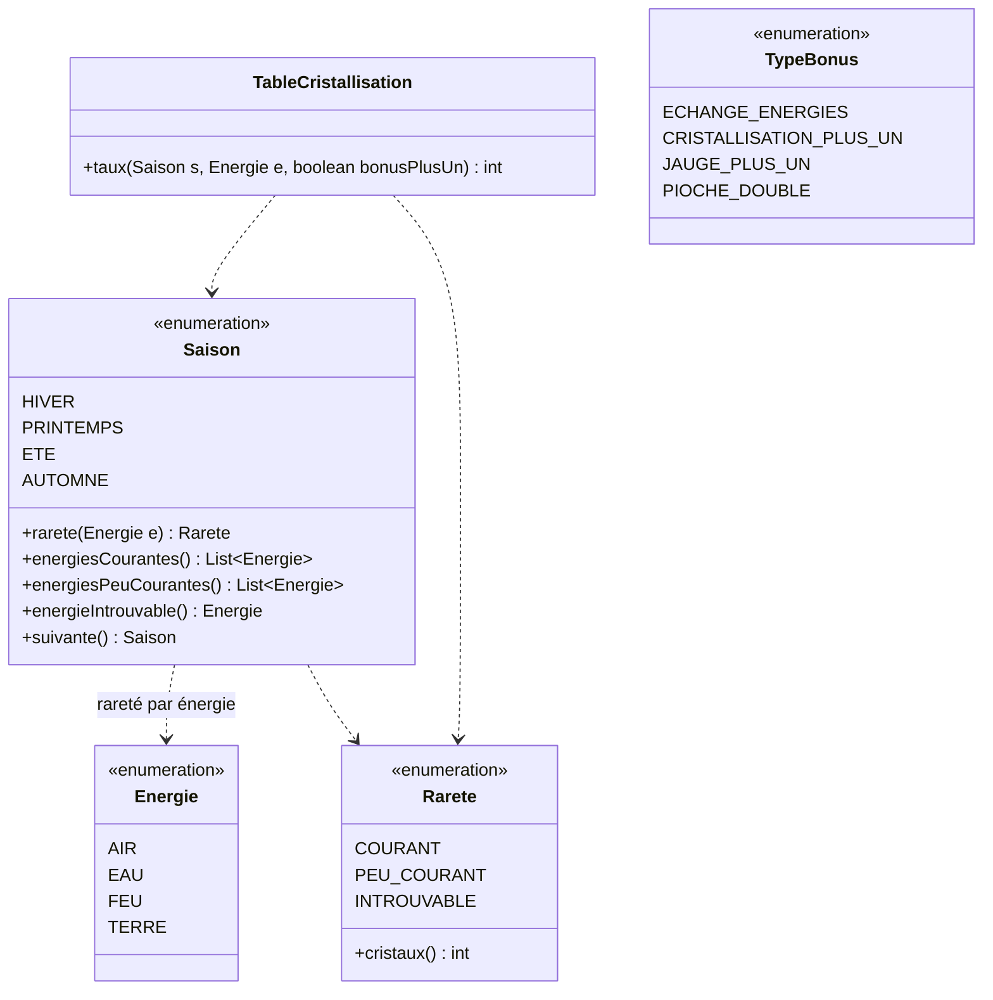
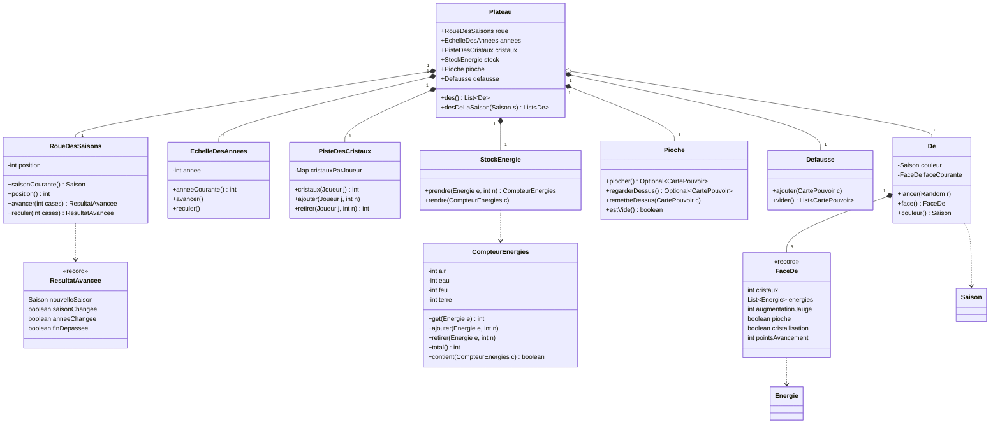
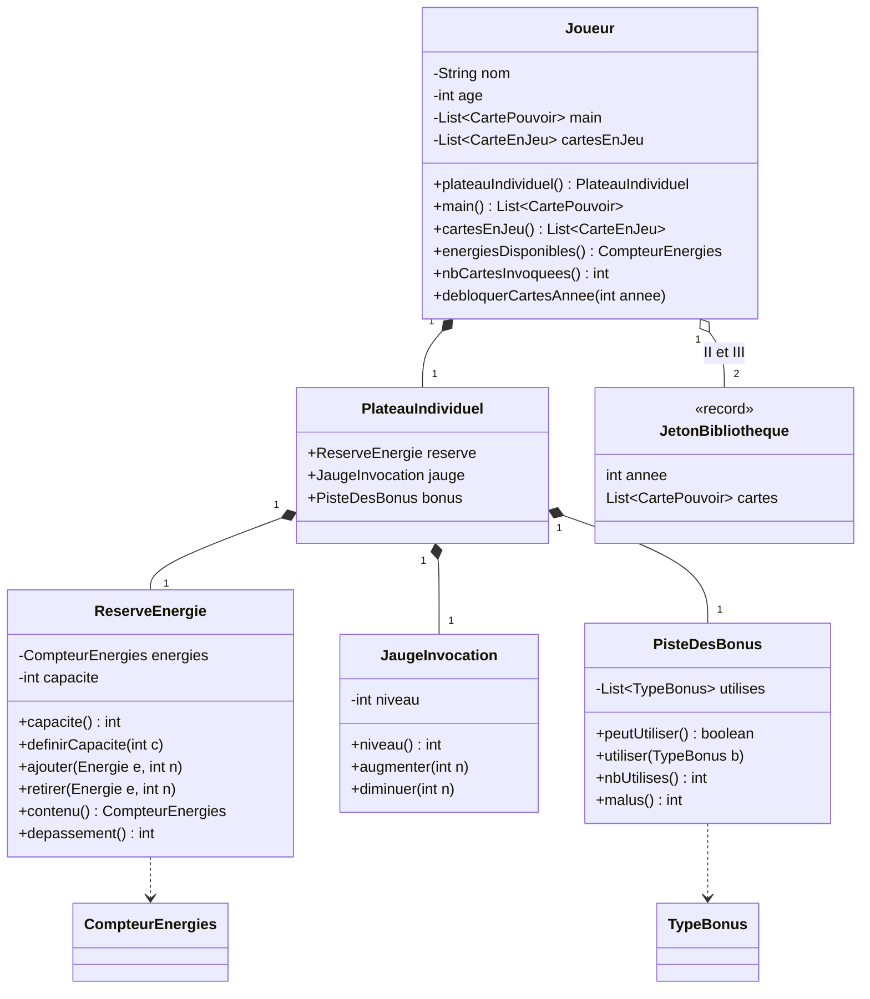

# 03 — Diagramme de classes : modèle du jeu

Package `fr.seasons.modele`. Ces classes représentent **l'état** du jeu (plateau, dés, joueurs, pions). Elles ne contiennent que les règles locales (par exemple : une réserve ne dépasse pas sa capacité). Les règles de déroulement sont dans le moteur.

## 1. Énumérations et valeurs

**Cours des énergies** (page 16 des règles, calculé par `TableCristallisation`) : `COURANT` = 1 cristal, `PEU_COURANT` = 2, `INTROUVABLE` = 3.

| Saison | Courant (1) | Peu courant (2) | Introuvable (3) |
|---|---|---|---|
| Hiver | Eau, Air | Feu | Terre |
| Printemps | Terre, Eau | Air | Feu |
| Été | Terre, Feu | Eau | Air |
| Automne | Feu, Air | Terre | Eau |

## 2. Plateau, dés, pioche

Remarques :

- Il y a **20 dés** : 5 par saison. Une partie à N joueurs utilise **N + 1 dés par couleur** (3, 4 ou 5).
- Chaque dé a 6 faces. Une `FaceDe` est décrite par des champs concrets (cristaux reçus, énergies reçues, augmentation de la jauge, pioche, autorisation de cristalliser) et par un nombre de points d'avancement (1, 2 ou 3) qui fait avancer la roue quand le dé n'est pas choisi. Ce format, plus simple qu'une liste d'actions, se lit directement dans `des.json` et permet aux robots d'évaluer une face en une ligne. Sur un dé : 2 faces à 1 point, 2 faces à 2 points, 2 faces à 3 points.
- **Le contenu exact des faces n'est pas décrit dans les règles** : il est chargé depuis `des.json` (voir `conception.md`, points à valider).
- `RoueDesSaisons` : cases 1 à 12 ; hiver = 1-3, printemps = 4-6, été = 7-9, automne = 10-12. Le passage de la case 12 à la case 1 déclenche un changement d'année.
- `PisteDesCristaux.retirer` ne descend jamais sous 0 et retourne le nombre de cristaux réellement retirés (utile pour Figrim, Kairn).

## 3. Joueur et plateau individuel

Règles locales portées par ces classes :

| Classe | Règle |
|---|---|
| `ReserveEnergie` | Capacité 7 par défaut, 10 avec le Grimoire ensorcelé (carte 18). `depassement()` indique combien d'énergies sont en trop quand une action en fait recevoir trop : le joueur doit garder 7 énergies avant toute autre action. |
| `JaugeInvocation` | Entre 0 et 15 ; un joueur peut avoir autant de cartes en jeu que le niveau de sa jauge |
| `PisteDesBonus` | 3 bonus maximum par partie ; malus de fin de partie : 0 → 0, 1 → 5, 2 → 12, 3 → 20 points |
| `Joueur.energiesDisponibles()` | Réserve + énergies posées sur l'Amulette d'eau (utilisables comme la réserve) |
| `Joueur.nbCartesInvoquees()` | Utilisé pour départager une égalité de points |

Les marqueurs de centaines de la piste des cristaux ne sont pas modélisés : le score est un entier.
