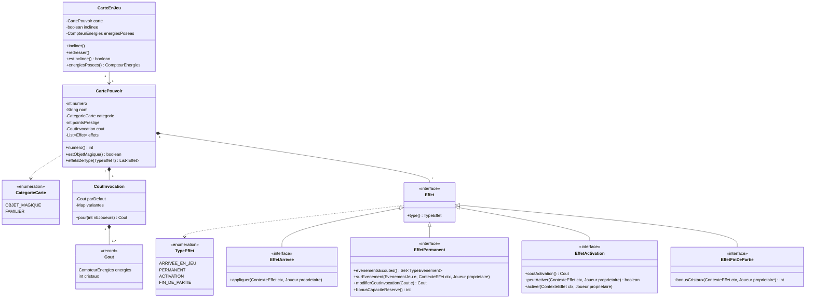
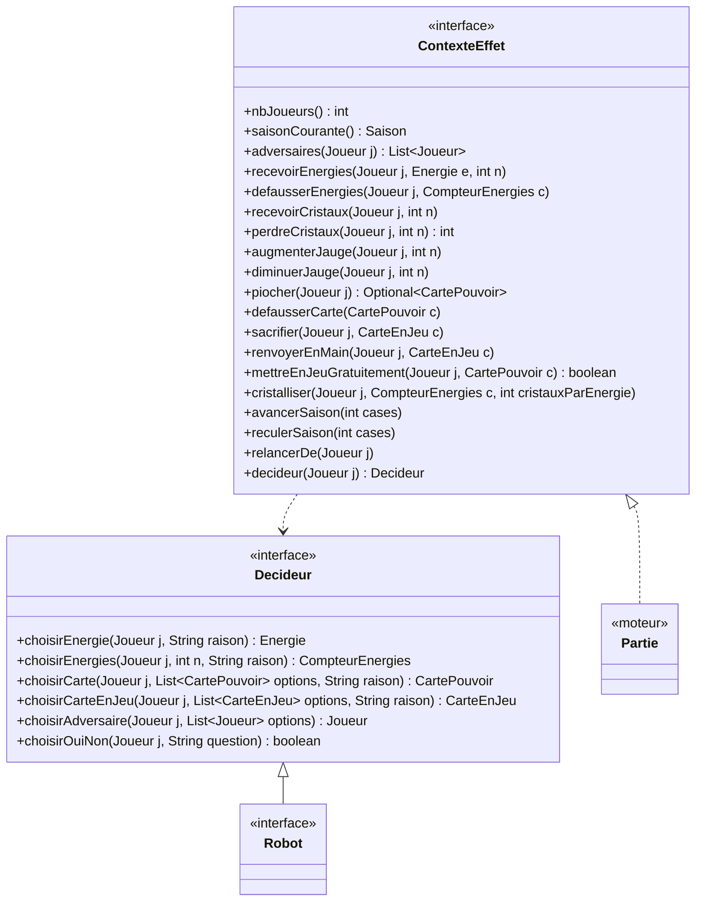
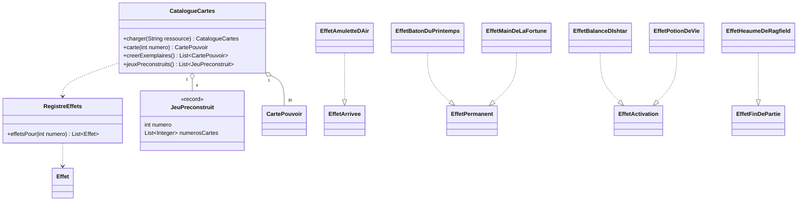

# 04 — Diagramme de classes : cartes pouvoir et effets

Les cartes se décomposent en **données** (nom, coût, points de prestige, type d'effet : fichier `cartes.json`) et en **comportement** (classes d'effet, une par carte qui a un effet). Ajouter ou modifier une carte ne demande pas de toucher au moteur.

## 1. Cartes et effets

Précisions :

- `CoutInvocation.pour(nbJoueurs)` : dans le périmètre des 30 cartes, seule **Figrim l'avaricieux (n° 11)** a un coût qui dépend du nombre de joueurs (2, 3 ou 4).
- Les cartes **Bottes temporelles (7)** et **Dé de la malice (15)** n'ont aucun coût d'invocation.
- `EffetPermanent.modifierCoutInvocation` sert à la Main de la fortune (20) ; `bonusCapaciteReserve` au Grimoire ensorcelé (18).
- Une carte peut porter plusieurs effets : le Grimoire ensorcelé a un effet d'arrivée (recevoir 2 énergies) et un effet permanent (réserve de 10).

## 2. Contexte d'exécution des effets et décisions

Un effet agit sur le jeu uniquement à travers `ContexteEffet` ; quand il faut un choix (énergie « de votre choix », adversaire, carte à sacrifier…), il passe par `Decideur`, que le robot implémente.

## 3. Catalogue et chargement

- `creerExemplaires()` crée les **60 cartes** (30 cartes en 2 exemplaires).
- Les classes d'effet (une par carte à effet) sont dans `fr.seasons.cartes.effets`. Le tableau complet est dans `catalogue-cartes.md`.
- Les cartes mises en jeu **gratuitement** (Calice divin, Potion de rêves) passent par `mettreEnJeuGratuitement` : elles ne publient pas l'événement `CARTE_INVOQUEE`, donc ne déclenchent ni le Bâton du printemps ni le Vase oublié d'Yjang.
