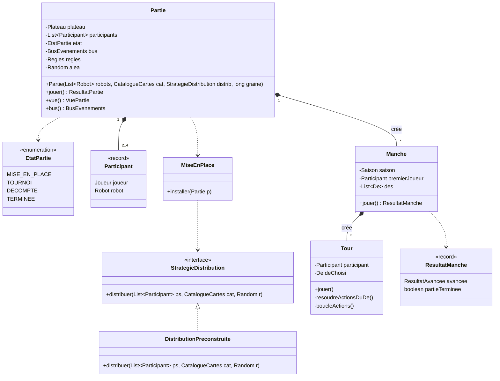
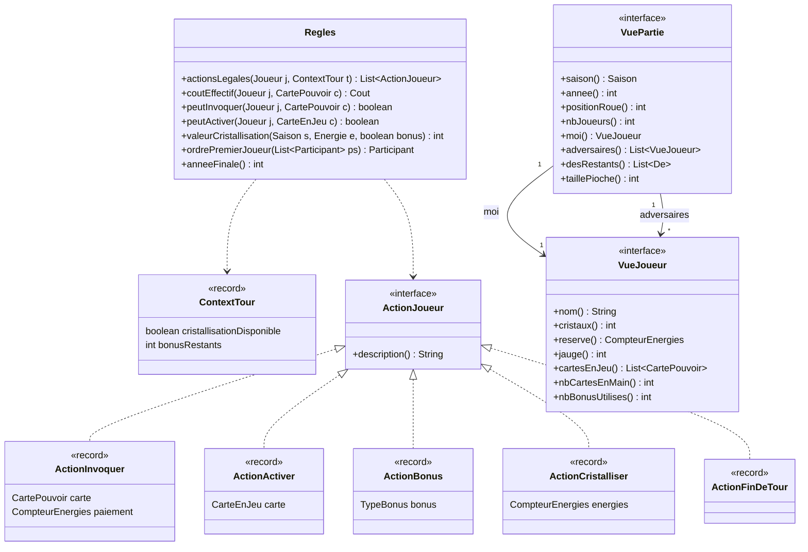
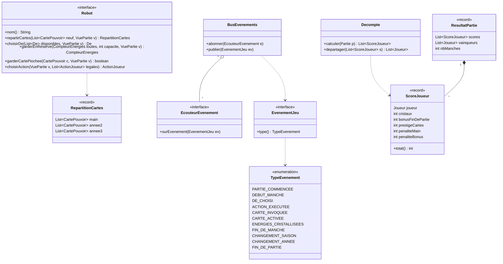

# 05 — Diagramme de classes : moteur de jeu

Package `fr.seasons.moteur`. Le moteur applique les règles et arbitre : il propose aux robots **uniquement des actions légales** (donc un robot ne peut pas tricher) et publie des **événements** pour l'affichage et les effets permanents.

## 1. Déroulement : Partie, Manche, Tour



`StrategieDistribution` isole la façon de distribuer les cartes : aujourd'hui **jeux pré-construits** (niveau Apprenti) ; un futur **draft** (si le client le demande) se brancherait ici sans modifier le reste.

## 2. Règles, actions, vues



- `VuePartie` et `VueJoueur` sont **en lecture seule** : un robot voit tout ce qui est public (cristaux, cartes en jeu, réserves) mais pas la main des adversaires.
- `ActionJoueur` suit le patron **Command** : l'action est un objet décrivant ce que le robot veut faire ; le `Tour` l'exécute après vérification.

## 3. Robot (port), événements, décompte



**Calcul du score** (`ScoreJoueur.total`) :

```text
total = cristaux
      + bonus de fin de partie (cartes à effet de fin de partie, ex. Heaume de Ragfield : +20 cristaux)
      + points de prestige des cartes en jeu
      - 5 x nombre de cartes encore en main
      - malus de la piste des bonus (0, 5, 12 ou 20)
```

Les énergies non utilisées en fin de partie ne rapportent rien. En cas d'égalité, le vainqueur est le joueur qui a invoqué le plus de cartes ; s'il y a encore égalité, la victoire est **partagée** (comptée comme « ex æquo » dans les statistiques).
