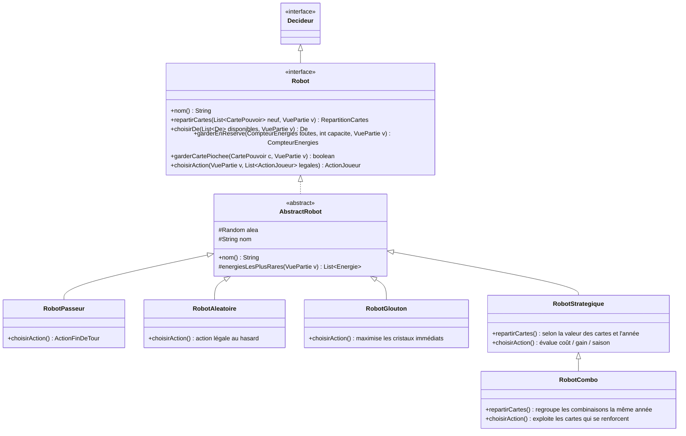
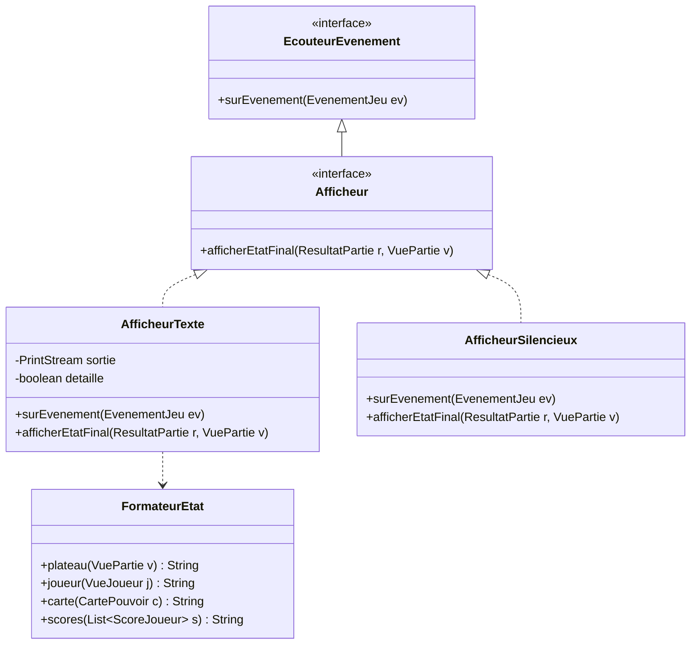
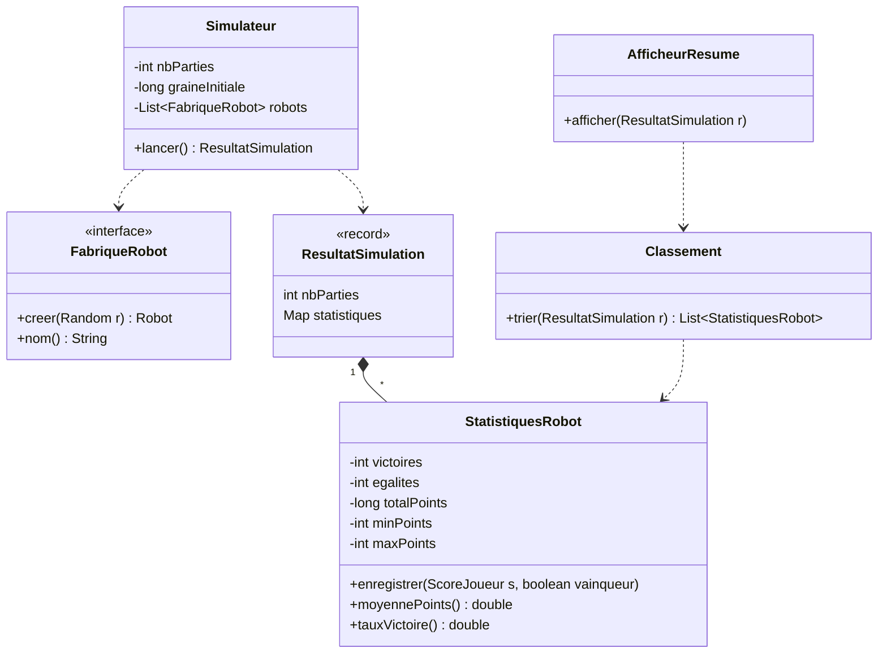

# 06 — Diagramme de classes : robots, affichage, simulation

## 1. Robots

Les robots implémentent l'interface `Robot` du moteur. Ils sont **sans état partagé** (un robot est créé par joueur) et utilisent un `Random` injecté pour que les simulations soient reproductibles.



### Stratégies prévues

| Robot | Sprint | Décisions et idée de stratégie |
|---|---|---|
| `RobotPasseur` | 2 | Termine son tour sans rien faire. Sert à valider la boucle de jeu et sert de référence « plancher » dans les statistiques. |
| `RobotAleatoire` | 3 (v1), 4 (v2) | Choisit au hasard parmi les décisions légales : dé, énergies à garder, répartition des 9 cartes en 3 paquets, invocation. |
| `RobotGlouton` | 5 | Maximise les cristaux immédiats : choisit le dé qui rapporte le plus de cristaux ou d'énergies rares, cristallise les énergies les plus rentables de la saison, invoque les cartes à gain direct (Amulette de terre, Statue bénie d'Olaf), utilise ses bonus si le gain dépasse le malus. |
| `RobotStrategique` | 6 | Évalue chaque carte (points de prestige, rentabilité, coût), répartit ses cartes sur les 3 années, garde des énergies selon la saison suivante, évite les cartes qui resteraient en main (−5 points chacune). |
| `RobotCombo` | 7 | Étend le stratégique : place ensemble les cartes qui se renforcent (Main de la fortune avant d'autres invocations, Bâton du printemps et Vase oublié d'Yjang avant une série d'invocations, Bourse d'Io avec Balance d'Ishtar ou Potion de vie), garde le Heaume de Ragfield et les cartes de fin de partie pour l'année 3. |

La règle du projet — **tout nouvel élément du moteur doit être utilisé par un robot** — est suivie dans `matrice-elements-robots.md`.

## 2. Affichage (observateurs)



- **Sprint 3** : affichage de **fin de partie** uniquement (`afficherEtatFinal`).
- **Sprint 7** : affichage **tout au long de la partie** via les événements (`surEvenement`).
- `AfficheurSilencieux` est utilisé par la simulation : aucune sortie, sauf le résumé final.

### Exemple de sortie attendue (fin de partie)

```text
=== FIN DE PARTIE (3 années, 31 manches) ===
Joueur        Cristaux  Prestige  Main  Bonus  TOTAL
Alice (Glouton)     87        62    -5     -5    139
Bob (Aléatoire)     54        41   -10      0     85
Vainqueur : Alice
```

## 3. Simulation



**Principe :** pour chaque partie, le simulateur crée de nouveaux robots (`FabriqueRobot`), fait varier la place de départ (premier joueur) pour ne pas favoriser un robot, joue la partie avec `AfficheurSilencieux`, puis cumule les résultats.

### Résumé attendu à l'écran (500 parties, exécution `simulation`)

```text
=== Simulation : 500 parties, 3 joueurs ===
Rang  Robot            Victoires  Taux   Moy. pts  Min  Max  Egalités
1     RobotStrategique       284  56,8%     131,4   62  212        3
2     RobotGlouton           171  34,2%     112,9   48  187        3
3     RobotAleatoire          42   8,4%      74,6   10  149        3
```

(Valeurs d'illustration uniquement.)
