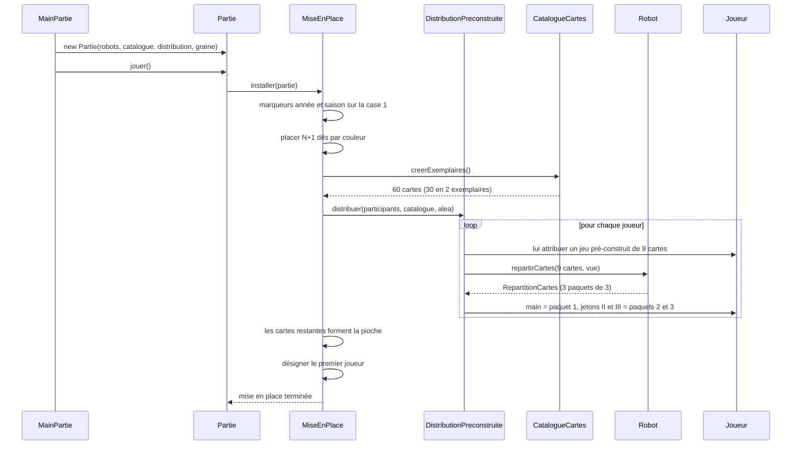
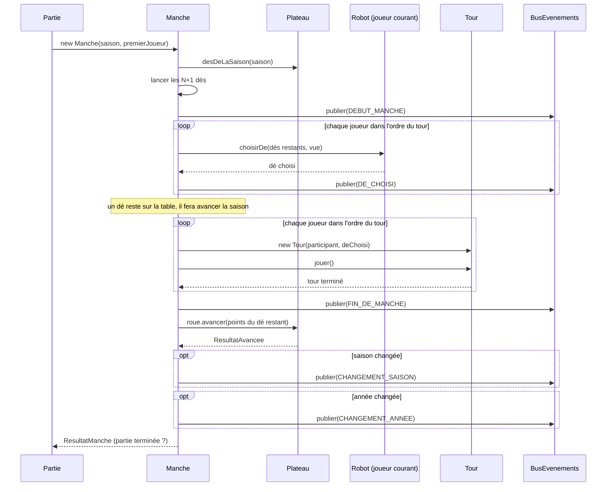
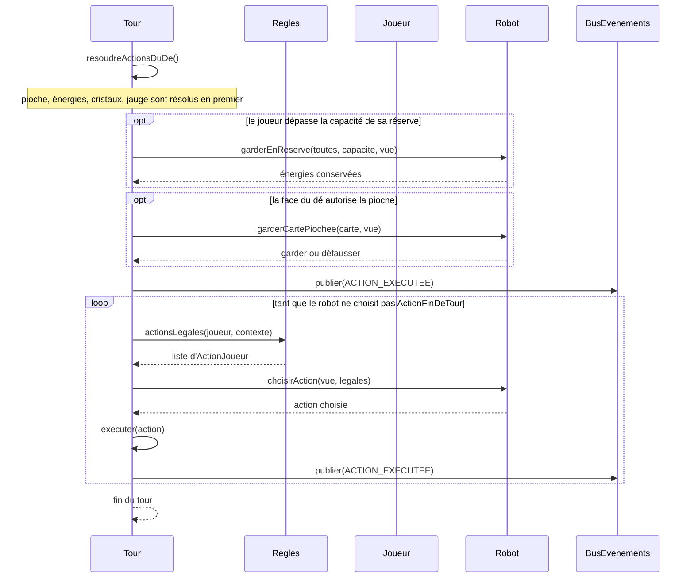
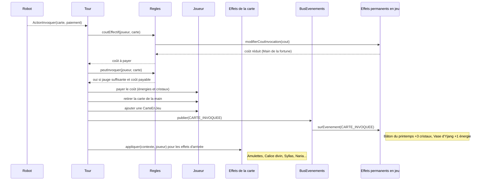
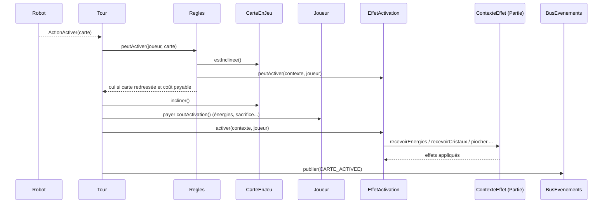
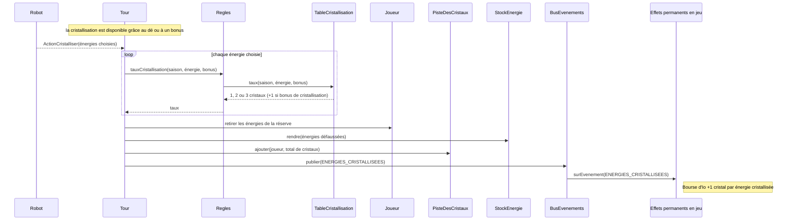
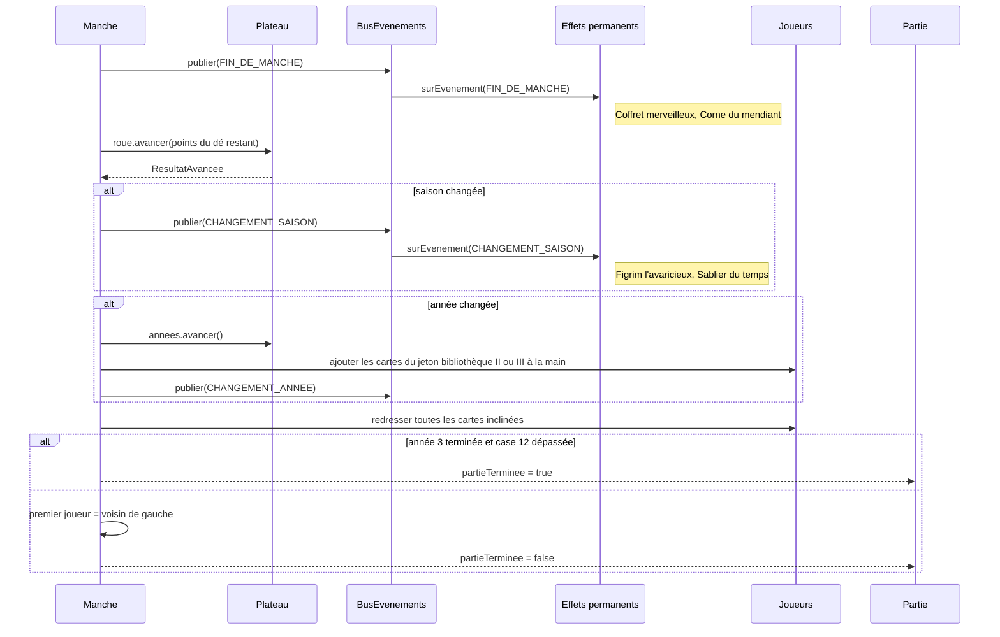
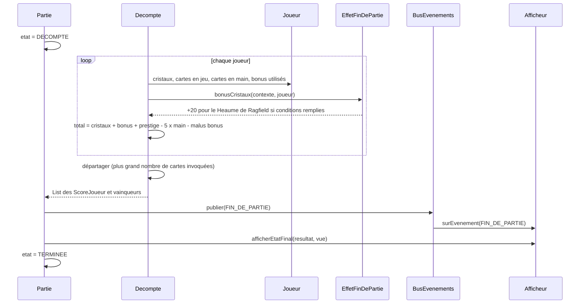

# 07 — Diagrammes de séquence

Huit scénarios clés. Les noms des participants correspondent aux classes des diagrammes 03 à 06.

## 1. Mise en place de la partie

## 2. Une manche complète

Ordre retenu à la fin de manche : 1) événement `FIN_DE_MANCHE` (Coffret merveilleux, Corne du mendiant), 2) avancée de la roue, 3) changements de saison et d'année (Figrim, Sablier du temps), 4) test de fin de partie. Ce choix est à valider (voir `conception.md`).

## 3. Le tour d'un joueur

## 4. Invocation d'une carte pouvoir

Une carte mise en jeu gratuitement (Calice divin, Potion de rêves) suit le même parcours **sans** paiement et **sans** l'événement `CARTE_INVOQUEE`.

## 5. Activation d'une carte pouvoir

La carte reste inclinée jusqu'au début de la manche suivante (redressement de toutes les cartes).

## 6. Cristallisation d'énergies

L'exemple des règles (hiver, 1 énergie de feu + 2 énergies de terre) donne 2 + 3 + 3 = **8 cristaux** : il sert de test.

## 7. Fin de manche, changement de saison et d'année

## 8. Fin de partie et décompte

