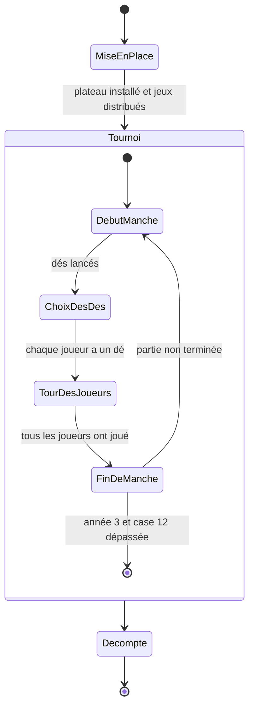
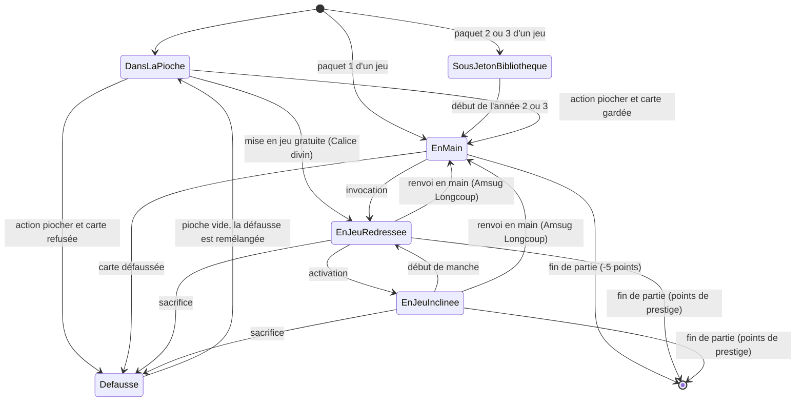
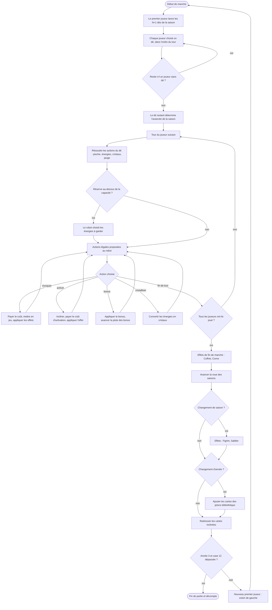

# 08 — Diagrammes d'états et d'activité

## 1. États d'une partie

Correspondance avec `EtatPartie` : `MISE_EN_PLACE`, `TOURNOI`, `DECOMPTE`, `TERMINEE`. Le **prélude** (draft) n'existe pas dans la version débutante : il est remplacé par la distribution des jeux pré-construits.

## 2. États d'une carte pouvoir

## 3. Diagramme d'activité : déroulé d'une manche

